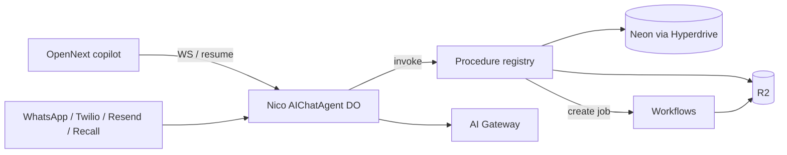
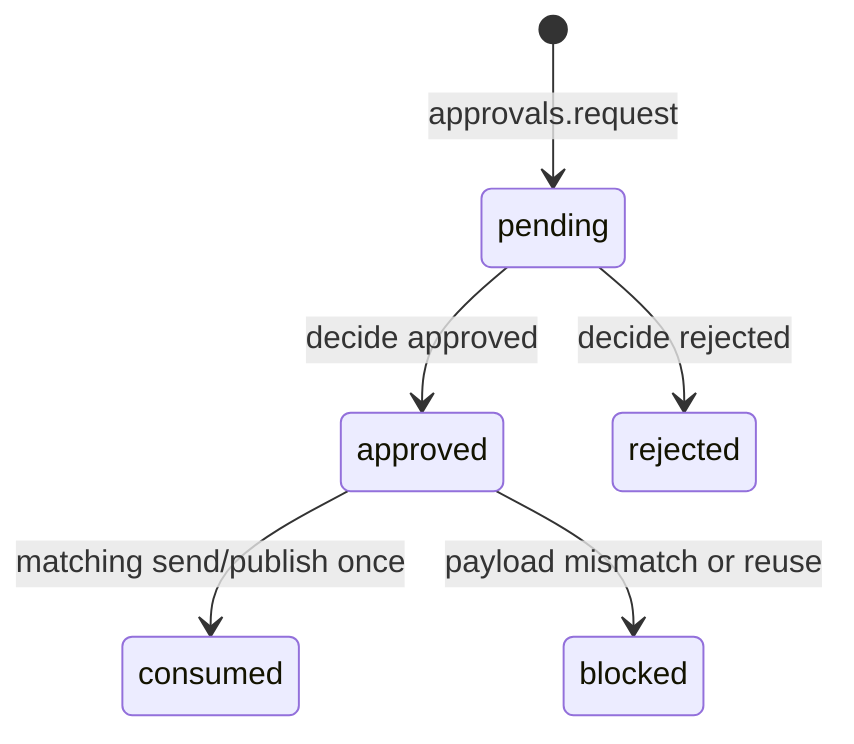

# Nico Remaining Build - Plan

## Goal Capsule

Finish Nico as a Cloudflare-hosted, agent-native consultant: ship the existing copilot onto Workers, give it a Durable Object session, then add artifacts, intake/NDA, channels, and truthful presence — without rewriting the procedure registry or changing the platform.

**Authority:** `docs/nico/01-overview.md` through `docs/nico/09-build-plan.md` for product; this plan for how. Session-settled platform choices override stale Norfolk/Clerk text in `.cursorrules` and `README.md`.

**Stop if:** a change would move hosting off Workers, put authorization in the UI or a channel adapter, invent investor-facing numbers, skip the approval gate for outbound human contact, or let a webhook mint `admin`/`member` or send without `registry.invoke`.

**Do not start OpenNext deploy until U2 (Workers-safe data) is done.** Current Prisma + filesystem retrieval will fail on workerd even if the Next build succeeds.

---

## Product Contract

### Summary

One plan for the rest of Nico. The working copilot, procedure registry, thesis knowledge, and Prisma schema stay. The plan covers what is still unbuilt or unshipped on the Cloudflare path already chosen.

### Problem Frame

The shell can chat against local markdown. It is not yet a signed-in, durable, deployable agent. WorkOS keys crash the app. Approvals and NDA rules exist on paper and in tables, but are not enforced. Artifacts, intake, and channels are unspecified in code. Shipping the current Node path to Workers without a data-access split will make the only working procedure go silent.

### Requirements

- R1. An authorized human signs in with WorkOS AuthKit and lands in the copilot as their `Profile` role. The `dev-local` admin exists only on an explicit local bypass. Preview and production with empty or partial WorkOS keys return no session.
- R2. Nico's session lives in a Durable Object: streams resume on reload; avatar states come only from real activity events.
- R3. Every UI or channel side effect goes through `registry.invoke`. The capability map and invoke both filter by role and `actor.kind`. Guessing a human-only name still fails.
- R4. Outbound human contact and data-room publish require a one-time approval bound to procedure plus canonical payload hash (payload minus `approvalId`). Status becomes consumed only after a successful invoke.
- R5. Confidential knowledge, artifacts, and data-room files check NDA inside the procedure for both clicks and agent calls. Valid NDA is `ndaSignedAt` plus a `NdaSignature` for the current template version.
- R6. Raise terms (ask, pre-money, instrument, board) render only from a published Deal Terms record. A 10-year P&L may use cited thesis figures when each input is labeled FACT / OPINION / ASSUMPTION on the assumptions sheet. No unlabeled invented number.
- R7. Artifact engines produce downloadable Excel with live formulas, a deck from Deal Terms, and a short podcast from a memo — via Workflows, not the request path. The first on-demand Excel is a 10-year income statement workbook for one or more Tamarindo entities (Tamarindo US, Tamarindo-Intervest, Tamarindo Colombia, Ashoka). Each entity sheet is fed by one internal engine per revenue center and per cost center. Those engines estimate manpower: FTE, contractors, functions, salaries, benefits, turnover, and related cost. Luca also delegates to one silent **fee engine** that owns every fee Tamarindo charges and every fee a Tamarindo entity pays (`lib/artifacts/fees.ts`). Sofia also runs a scheduled **watch engine** for regulation and ecosystem news (`lib/research/watch-topics.ts`). Unlabeled numbers are refused. (session-settled: user-directed.)
- R8. Intake is invite → interview → bio → click-wrap NDA → data-room unlock. The signed PDF, `NdaSignature`, `ConsentRecord`, and audit fields persist together.
- R9. Phone, WhatsApp, email, and meeting-bot adapters call the same orchestrator. In-window inbound reply is an orchestrator emit, not `communications.send`. Proactive outreach stays approval-gated.
- R10. Deployed secrets live in Cloudflare; local secrets live in `.dev.vars`. No Doppler in this plan.
- R11. Nico discloses he is an AI on every outward channel. Only Nico authors user-visible messages. Specialists never speak on a channel or write a conversation `Message`.

### Actors

- A1. Admin — team operator; may decide approvals, publish terms, invite, open Admin.
- A2. Member — Tamarindo team; may request outbound and create artifacts.
- A3. Investor — after NDA, data room and confidential knowledge; before NDA, public tier only.
- A4. Nico (agent) — tool calls use `{ kind: "agent", id: <signed-in authSubject>, role: <Profile.role> }`. Never decides approvals, signs NDAs, confirms bio, or publishes terms.
- A5. Guest — unauthenticated; only public marketing and invite accept.

### Key Flows

- F1. Sign-in → profile upsert → copilot with role-filtered capability map.
- F2. Chat turn: DO session → `knowledge.search` → compose via AI Gateway → stream tokens + sources + activity.
- F3. Outbound: Nico drafts → `approvals.request` → admin `approvals.decide` → `communications.send` with that `approvalId` once.
- F4. Intake: invite → AuthKit → interview (`profile.update`) → bio confirm → `nda.prepare` → human `nda.sign` → `ndaSignedAt` set.
- F5. Artifact: user or Nico asks for a 10-year income statement for one or more entities → Luca starts one center engine per revenue/cost center → Workflow writes P&L + manpower sheets → `artifacts.get` until ready → same `Artifact` row + R2 object.

### Acceptance Examples

- AE1. WorkOS keys present: sign-in works; the app does not throw on boot.
- AE2. Reload mid-answer: the stream continues; the orb is not idle until `done`.
- AE3. Admin-role agent cannot call `approvals.decide` or `nda.sign`.
- AE4. An approval for recipient A / body X cannot send recipient B / body Y; reuse of the same `approvalId` fails.
- AE5. Unsigned investor is denied `dataroom.download` and confidential passages from both the UI and an agent invoke.
- AE6. "Build a 10-year income statement for Tamarindo US and Ashoka" yields a `.xlsx` with one P&L sheet per entity, a manpower sheet per entity (FTE, contractors, functions, salary, benefits, turnover by center), live formulas, and an assumptions sheet citing sources. A pay or headcount cell without a FACT / OPINION / ASSUMPTION citation stays blank rather than invented.
- AE7. WhatsApp inbound in the 24-hour window replies without an approval card; a proactive template send without approval is refused.

### Scope Boundaries

**In:** remaining slices from `docs/nico/09-build-plan.md` — Workers/OpenNext, WorkOS, DO session, procedure holes, artifacts, intake/NDA, channels, avatar contract.

**Out of identity:** Tamarindo as a balance-sheet lender; exclusivity with one capital partner; model-invented deal terms.

**Deferred to follow-up:** Doppler; Documenso; one-voice-everywhere; Grok Voice in the copilot (`docs/nico/04-channels.md`); Framer Motion transitions (CSS first; Rive asked); autos product; second corridor; certificate-grade signing; rewriting `.cursorrules` Clerk text beyond a pointer (except if an implementer is blocked by it).

---

## Planning Contract

### Key Technical Decisions

- KTD1. Sibling Worker + Durable Object for Nico's session, OpenNext Worker for the Next shell. (session-settled: user-approved — chosen over growing `app/api/nico/chat` into an `AIChatAgent`: Agents SDK chat persistence and resume live on DOs, not Route Handlers.) Only `workers/nico-agent/` exports `NicoAgent`. U4 binds Hyperdrive and R2 only — no OpenNext-hosted DO class. U6 adds the sibling script and an OpenNext service binding via `script_name`. Route `/agents/*` to that Worker so `useAgentChat` talks to the sibling. After resume is proven, delete `app/api/nico/chat` — do not keep a proxy that re-runs `runTurn`. Session key is `profileId` + `conversationId`.
- KTD2. Prisma on Workers uses a driver adapter through Hyperdrive to Neon. Each isolate calls `createDataPort(env)` (`lib/db.ts` today constructs the pg adapter lazily). Procedures eventually take the port from context, not a process-global scrape. Bindings (R2, Hyperdrive) are injected.
- KTD3. `knowledge.search` keeps its contract. Until U5 wires NDA, the handler returns only `public` tagged passages. Later: pgvector behind the same name. Untagged is confidential.
- KTD4. Procedure contract gains `humanOnly`. The map filters by role and actor kind; `registry.invoke` also rejects `humanOnly` when `actor.kind === "agent"`. Nico inherits `{ kind: "agent", id: <signed-in authSubject>, role: <Profile.role> }`. `profileId` is only for DO / conversation keys (KTD1).
- KTD5. Approval rows bind procedure + canonical payload hash (exclude `approvalId`). Status becomes `consumed` after one successful invoke. The additive U5 migration also stores `conversationId` (or session key) so `approvals.decide` can `idFromName` + stub.fetch the waiting DO. Do not poll Neon from the DO as the resume mechanism.
- KTD6. Chat uses `@cloudflare/ai-chat` `AIChatAgent` + `useAgentChat` against the sibling Worker. After resume is proven, delete the SSE route.
- KTD7. Long jobs are Cloudflare Workflows exported from one script (name it in U4). Bind that Workflow on OpenNext and the Nico Worker. `artifacts.create` starts the job only through the injected binding. `artifacts.get` re-checks owner + current NDA (Workflows do not re-authorize).
- KTD8. One outbound primitive `communications.send` (email, whatsapp, sms, later call). Calendar invite and `dataroom.publish` stay separate, also approval-gated. In-window inbound reply is an orchestrator emit, not a send and not a new procedure (chosen over `communications.reply`: a named ungated send is a side door).
- KTD9. Pin one Next trio before adding OpenNext. Prefer a patched 16.2.x (16.2.5+ per Cloudflare/Next advisories) or a consistent 16.3.x lock — `package.json` currently says 16.3.1 while the lock is 16.2.11.
- KTD10. Changing `middleware.ts` for AuthKit requires explicit user permission at implementation time. (session-settled: user-directed — WorkOS over Clerk.) Allowlist only: health, named provider webhook paths, DO handshake. `/api/nico/capabilities`, `/api/nico/chat`, invite/NDA/admin stay session-gated (401 if no session). The handshake is not cookie-auth and is not anonymous: OpenNext→DO service binding or a short-lived signed assertion binding `authSubject` + `profileId` + `conversationId`; reject anonymous attach; check Origin on browser WS.
- KTD14. `dev-local` only when `DATABASE_URL` is loopback and `ALLOW_DEV_LOCAL` is not `0`. Forbid the bypass on `CF_PAGES`, `CLOUDFLARE_ENV=production`, and any workers.dev / preview host. Empty or partial WorkOS keys on a non-loopback host return no session.
- KTD11. User-facing tools are registry procedures only. Luca / Sofia / Matteo / Pietro stay off the capability map, must not call `communications.send`, and must not write conversation messages. For the 10-year workbook, Luca delegates to one silent center engine per P&L center in `lib/artifacts/centers.ts` (revenue or cost) and to one silent **fee engine** that owns `lib/artifacts/fees.ts` (charged vs paid). Those engines never speak to users. Sofia may supply cited comps for pay/benefits; she does not invent a salary. Sofia also owns a scheduled watch loop (`lib/research/watch-topics.ts`) that must not write conversation messages.
- KTD15. Regulation/news watch is a Cloudflare Workflow on a topic cadence (6h / 24h / 7d), not a tight loop on every chat turn. Provider is **Exa** (Q9 settled 2026-08-22). Do not install an SDK — HTTP fetch only after `EXA_API_KEY` exists. Persist hits only after an additive migration is approved. Until then the topic catalog is the contract. Findings are public-tier until U5 NDA; do not promote a scraped claim to FACT without a stored source URL.
- KTD12. Approval interrupt: `approval_required` → `approvals.request` → persist `awaiting_approval` on the DO → a human `approvals.decide` notifies/resumes that DO with the same payload. Do not auto-retry send.
- KTD13. Only `lib/auth` (plus a channel mapper that returns an existing `Profile`, then a shared actor builder) may construct `ProcedureContext.actor`. Re-read Profile on each invoke. Admin mutations (deal-terms publish, dataroom publish, invites) are procedures — no Prisma writes from Admin UI or adapters.

### High-Level Technical Design

NDA access is a procedure check, not a route: unsigned investors stay on the public tier; a current-template `NdaSignature` unlocks confidential `knowledge.search` passages, `dataroom.*`, and private artifacts.

R2 objects are not fetchable except via a procedure (or a short-lived URL issued by one). Neon `Conversation` / `Message` / `AuditLog` are source of truth; DO SQLite is resume cache only.

### Assumptions

- A Cloudflare account, Neon project, and WorkOS AuthKit app will exist before U3–U4 are closed.
- Local Docker desktop will be started before applying `prisma/migrations/20260822001500_init`.
- New npm packages are asked for before install, per repo rules.
- Recall, Twilio, and Meta WABA accounts are obtained by U8 start (calendar), not before U1. Code for those adapters is U9.

### Sequencing

U1 → U2. U3 (permission gate) and U4 packaging run in parallel after U2; U4 must not wait on `middleware.ts`. U4's R1 / fail-closed preview check runs after U3 session behavior exists. U5 after U1 (can overlap U2–U4). U6 after U4 and U5. U7 after U4 and U5. U8 after U3 and U5 (parallel with U7). U9 after U6 and U8. U10 starts with U6. U11 after U4 (live provider after Q9).

### Sources and Research

- Repo scan of `lib/procedures`, `lib/nico`, `lib/auth`, `prisma/schema.prisma`, `docs/nico/*`.
- Cloudflare Agents chat docs (updated 2026-08-20): `AIChatAgent` / `useAgentChat` in `@cloudflare/ai-chat`; resume and SQLite persistence are DO features.
- Cloudflare changelog: Next.js patched releases 15.5.16 / 16.2.5; Agents SDK continues to move (readable state, MCP). Implementer must re-read current docs at unit start — do not freeze package APIs from this plan.

---

## Implementation Units

| U-ID | Title | Primary files | Depends on |
|------|-------|---------------|------------|
| U1 | Apply data layer locally | `prisma/*`, `lib/auth/index.ts`, `lib/procedures/registry.ts` | — |
| U2 | Workers-safe data access | `lib/db.ts`, `lib/procedures/knowledge-search.ts`, `next.config.ts` | U1 |
| U3 | WorkOS AuthKit | `lib/auth/index.ts`, `middleware.ts`, sign-in routes | U1 |
| U4 | OpenNext + wrangler | `wrangler.toml`, `open-next.config.ts`, `package.json` | U2 |
| U5 | Procedure contract holes | existing `lib/procedures/*`, additive Approval migration | U1 |
| U6 | Durable Object session | `workers/nico-agent/`, `lib/nico/composer.ts`, copilot | U4, U5 |
| U7 | Artifact engines | extend `lib/procedures/artifacts.ts`, new `lib/artifacts/` | U4, U5, U2 |
| U8 | Intake and NDA | new nda/dataroom/invite procedures | U3, U5 |
| U9 | Channel adapters | webhooks + extend `communications.ts` | U6, U8 |
| U10 | Avatar contract | `events.ts`, orb, orchestrator rename | U6 (enum rename starts with U6) |

### U1. Apply the data layer locally

**Goal:** The schema and seed run against local Postgres so approvals, profiles, and audit writes stop failing closed.

**Requirements:** R4 (audit/approval tables exist)

**Dependencies:** none

**Files:** `prisma/schema.prisma`, `prisma/migrations/20260822001500_init/migration.sql`, `prisma/seed.ts`, `docker-compose.yml`, `lib/auth/index.ts`, `lib/procedures/registry.ts`, `lib/http/api-response.ts`, `lib/procedures/approvals.test.ts`

**Approach:**
1. Start `pgvector/pgvector:pg16` via the existing Compose file and apply the existing init migration. Do not invent a second init schema. Additive Approval consume/hash work is U5, not this unit.
2. Seed the `dev-local` admin and draft Deal Terms (already specified). Restrict `dev-local` so it cannot be the session on a non-local host.
3. Make profile upsert fail loudly in non-dev when the database is down. In non-dev, a failed audit persist for a gated procedure must not finish as success.

**Execution note:** Smoke-first. Prove migrate + seed + one `capabilities.list` audit row before writing more procedures.

**Patterns to follow:** `lib/db.ts` singleton; `jsonOk` / `jsonErr` from `lib/http/api-response.ts`.

**Test scenarios:**
- Happy: seed creates admin `dev-local` and Deal Terms version 1 as draft.
- Edge: second seed is idempotent.
- Error: `approvals.request` without a Profile returns a clear error, not a 500 stack.
- Integration: `capabilities.list` writes an `AuditLog` row.

**Verification:** Local Studio shows Profile, DealTerms, and an audit row after one copilot load.

### U2. Workers-safe data access

**Goal:** Neon queries and knowledge retrieval work without the Node filesystem or the native Prisma engine.

**Requirements:** R3, R5, R10

**Dependencies:** U1

**Files:** `lib/db.ts`, `prisma/schema.prisma`, `prisma.config.ts`, `next.config.ts`, `lib/procedures/knowledge-search.ts`, `lib/procedures/knowledge-search.test.ts`, `.dev.vars.example`

**Approach:**
1. Introduce a Prisma driver adapter suitable for Hyperdrive / Neon. Ask before adding the adapter package. Keep the generated-client alias (`lib/generated/prisma`). Update `serverExternalPackages` in `next.config.ts` so the native engine is no longer the Workers path.
2. Replace filesystem walks in `knowledge.search` with an injectable corpus (R2 or build-time curated markdown). Keep the procedure name and Zod I/O. Tag each passage `public | confidential`; untagged is confidential (KTD3).
3. Leave `MemoryChunk` embeddings as a later swap. Until U5, `knowledge.search` returns only public-tagged passages so a preview cannot leak `docs/nico`.

**Execution note:** Prove retrieval in Node first with the new corpus source, then confirm the adapter constructs under a Workers-like constraint (no `fs` in the handler).

**Patterns to follow:** existing `knowledge.search` contract comments in `lib/procedures/knowledge-search.ts`.

**Test scenarios:**
- Happy: same query returns thesis passages without reading `knowledge/` from disk at request time.
- Edge: empty corpus returns zero passages, not an exception.
- Error: missing DATABASE_URL fails at process start or first query with a named error, and does not take down the capability map.
- Integration: `knowledge.search` still appears on the capability map with unchanged name.

**Verification:** Copilot answers an ICP question after the filesystem walk is gone.

### U3. WorkOS AuthKit

**Goal:** Real identities; WorkOS keys no longer crash boot.

**Requirements:** R1

**Dependencies:** U1

**Files:** `lib/auth/index.ts`, `middleware.ts` (permission required), `app/sign-in/`, AuthKit callback route, `lib/auth/session.test.ts`

**Approach:**
1. Ask before installing `@workos-inc/authkit-nextjs` and before editing `middleware.ts`.
2. Map WorkOS user → `Profile` upsert on `authSubject`. First login is `guest`. Do not copy WorkOS metadata into `role` on create or update. Roles change only via invite accept or an admin humanOnly procedure.
3. Wired 2026-08-22: `@workos-inc/authkit-nextjs` + composable `authkit()` in `middleware.ts` (kept as Edge middleware; OpenNext does not support Next 16 `proxy.ts` yet). Allowlist: health, named webhook prefixes, `/api/nico/handshake`, `/agents/*`. `/api/nico/capabilities` and `/api/nico/chat` 401 without a session. Pages redirect to `/sign-in`.
4. First WorkOS login upserts Profile as `guest`. Roles are never copied from WorkOS metadata. `dev-local` follows KTD14.

**Patterns to follow:** `lib/auth` as the only provider-aware module.

**Test scenarios:**
- Happy: a mocked WorkOS session yields an actor whose id is the WorkOS subject and whose role comes from Profile.
- Edge: first login creates Profile as guest until an invite/admin sets role.
- Error: partial config (key without client) fails closed with a named error, not a throw from `resolveWorkosActor` on every request. Empty keys on a non-local host also fail closed.
- Integration: `GET /` with no session redirects to a real sign-in page.

**Verification:** AE1. `/sign-in` exists. Setting keys does not 500 the homepage.

### U4. OpenNext on Cloudflare Workers

**Goal:** The Next shell deploys to Workers with native secrets.

**Requirements:** R10

**Dependencies:** U2

**Files:** `wrangler.toml`, `open-next.config.ts`, `package.json`, `next.config.ts`, `.dev.vars.example` (already present — do not recreate), `app/api/health/route.ts`, `app/api/nico/capabilities/route.ts`

**Approach:**
1. Installed 2026-08-22: `@opennextjs/cloudflare` + `wrangler`. Next trio pinned at 16.3.1 (KTD9).
2. Bind Hyperdrive and R2 only. Do not declare a Nico DO class on the OpenNext Worker (KTD1). Workflow name reserved: `nico-artifacts` / binding `NICO_ARTIFACTS`. `runtime = "nodejs"` is already gone from capabilities.
3. Secrets via `wrangler secret` / `.dev.vars` only. Preview smoke still needs a real Hyperdrive id and `npm run preview`.

**Execution note:** Packaging/config — prefer deploy-preview smoke over unit tests.

**Test scenarios:**
- Happy: `wrangler` preview serves health and either `/` or a 302 to `/sign-in` when there is no session. Logged-out copilot chrome is not required.
- Error: missing `DATABASE_URL` secret fails health with the JSON envelope, not an HTML dump.
- Integration (after U3): unauthenticated `GET /api/nico/capabilities` is 401. Turnstile is not required on copilot GET; it is reserved for invite accept (U8).

**Verification:** Preview URL is fail-closed without a session. No Vercel project is created. No OpenNext-hosted DO class.

### U5. Close procedure contract holes

**Goal:** Parity and gates match the product rules before the DO exposes tools.

**Requirements:** R3, R4, R5, R6

**Dependencies:** U1

**Files:** `lib/contracts/procedure.ts`, `lib/procedures/registry.ts`, `lib/procedures/approvals.ts`, `lib/procedures/artifacts.ts`, `lib/procedures/deal-terms.ts`, `lib/procedures/knowledge-search.ts`, `lib/domain/access.ts`, `lib/procedures/index.ts`, `prisma/schema.prisma`, additive Approval migration (ask permission), `lib/procedures/registry.test.ts`, `components/nico/left-rail.tsx`

**Approach:**
1. Add `humanOnly`. Filter `capabilities.list` by role and actor kind. Enforce the same check on invoke (KTD4). Map filter is UX; invoke deny is the control.
2. Ask permission for an additive Approval migration: `consumed` status, stored payload hash, and `conversationId` (KTD5). Do not edit the init migration.
3. Replace the timestamp-only `hasSignedNda` helper. Confidential reads require `ndaSignedAt` **and** a `NdaSignature` for the current template. Do not register nda / dataroom / invitations / profile / meetings stubs here — those land in U8/U9 when handlers are real.
4. Extend existing procedure files only. `dealTerms.publish` is humanOnly. `profile.confirmBio` is humanOnly. `profile.update` (when U8 adds it) accepts only `displayName`, `org`, `bio` — never `role`, `ndaSignedAt`, or `authSubject`. `approvals.list` stays agent-callable.

**Patterns to follow:** `defineProcedure` + registry invoke + audit.

**Test scenarios:**
- Happy: member agent sees `artifacts.create` and not `approvals.decide`. Same admin Profile: user map includes `approvals.decide` / `nda.sign`; agent map does not.
- Edge: unsigned investor `knowledge.search` returns only public-tier passages for both user and agent (AE5).
- Error: AE4 — mismatched payload or reused `approvalId` throws `approval_required`. Concurrent double-send: one succeeds, the other fails. Failed send does not consume.
- Integration: UI admin can `approvals.decide`; direct invoke as `kind: "agent"` and `role: "admin"` is `forbidden` (AE3). Left rail (`components/nico/left-rail.tsx`) equals `capabilities.list` for that actor.

**Verification:** Capability map printed in the left rail matches the filtered registry.

### U6. Durable Object session

**Goal:** Chat survives reload and is the runtime channels will share.

**Requirements:** R2, R11

**Dependencies:** U4, U5

**Files:** create `workers/nico-agent/`, `lib/nico/orchestrator.ts`, `lib/nico/composer.ts`, `app/api/nico/chat/route.ts` (today `runtime = "nodejs"`), `app/api/nico/capabilities/route.ts`, `components/nico/copilot.tsx`, `lib/contracts/events.ts`

**Approach:**
1. Installed 2026-08-22 with `--legacy-peer-deps`: `agents`, `@cloudflare/ai-chat`, `ai`, `@ai-sdk/react`. Current Agents SDK peers Zod 4; the repo stays on Zod 3 until a dedicated migration. Handshake, Neon persist, agent-kind tool invoke, DO `runTurn`, conversation hydrate, and AE2 stream-apply are in. Copilot stays on SSE until `NEXT_PUBLIC_NICO_AGENT_URL` is set and a live mid-stream reload is proven — do not delete `app/api/nico/chat` yet.
2. Tools on the agent are `capabilities.list` invoked as `kind: "agent"`, not a second tool list.
3. Persist conversation to Neon `Conversation`/`Message` keyed by `profileId` + `conversationId`. DO SQLite is resume cache only and must not accept writes that skip the registry.
4. Move `runTurn` / `composeAnswer` onto the DO (KTD6). Prove resume, then delete `app/api/nico/chat`. Implement KTD12 using `Approval.conversationId`. Rename avatar `searching` → `researching` here so the DO never emits the old name (U10 finishes CSS/orb).
5. Authenticate the handshake (KTD10): service binding or short-lived signed assertion. Reject anonymous attach. Check Origin on browser WS.
6. Next chrome can render if the DO or Gateway is down; capabilities stay listable if retrieval is down (named error, not boot throw).

**Execution note:** Prove resume with a mid-stream disconnect test before deleting the SSE route.

**Test scenarios:**
- Happy: AE2 — reload mid-stream continues tokens.
- Edge: two tabs on the same session see the same messages. Approval decide from the OpenNext rail resumes the waiting DO with the same `approvalId`.
- Error: model/gateway failure emits `error` and returns orb to idle.
- Integration: a tool call from the DO is a `registry.invoke` with `actor.kind === "agent"` and `actor.id` equal to the session `authSubject`. `AuditLog.actorKind` is `agent`.

**Verification:** Slice-3 DoD from `docs/nico/09-build-plan.md`: DO round-trip, capability map, approval card, resume.

### U7. Artifact engines

**Goal:** Shared workspace artifacts whose first Excel is a 10-year income statement for one or more Tamarindo entities, with live formulas.

**Requirements:** R6, R7

**Dependencies:** U4, U5, U2

**Files:** `lib/artifacts/centers.ts`, `lib/artifacts/fees.ts`, `lib/research/watch-topics.ts`, new excel/deck/podcast engines, extend `lib/procedures/artifacts.ts`, `lib/procedures/deal-terms.ts`, Workflow entry, `lib/artifacts/excel.test.ts`

**Approach:**
1. Ask before HyperFormula, ExcelJS, PptxGenJS, Gemini TTS packages.
2. `artifacts.create` starts a Workflow; `artifacts.get` returns status + storage ref (KTD7). Specialists run inside that Workflow (KTD11).
3. First Excel kind: a 10-year P&L plus manpower workbook. Caller names one or more of Tamarindo US, Tamarindo-Intervest, Tamarindo Colombia, Ashoka. One P&L sheet, one manpower sheet, and one fee sheet per entity. Luca starts one center engine per row in `PNL_CENTERS` and one fee-engine pass over `FEE_LINES` for those entities. Each center engine owns FTE, contractors, functions, salary, benefits, and turnover for that center only. The fee engine owns charged vs paid rates and counterparties. Years 1–10 are formula-driven. Pay cells and uncited fee rates stay blank until cited (Y1–2 US/CO headcount may use the Aug 19 lean-team OPINION; activation 2% is FACT). Optional family rollup is a later sheet, not a silent default.
4. Deck ask slide still reads published Deal Terms only via `dealTerms.get` (R6). If none published, refuse rather than invent. Agent cannot `dealTerms.publish`.
5. Same `Artifact` row for chat and the rail. `artifacts.list` / `get` scope to `createdById` (admin may list all). Downloads are procedure-issued signed URLs (TTL ≤ 5 minutes, audience = profileId). R2 binding is private — no r2.dev public listing.

**Test scenarios:**
- Happy: AE6 — 10-year P&L plus manpower and fee sheets for Tamarindo US and Ashoka; changing an FTE or salary assumption recomputes that center's cost and the entity P&L; changing a cited fee rate recomputes that entity's fee lines.
- Edge: create for a single entity (Intervest only) yields one entity sheet plus assumptions. A second job for Colombia is listed separately.
- Error: a request that needs an unpublished ask figure or an uncited growth rate fails with a named error instead of a filled-in number. Investor A cannot list or get investor B's artifact.
- Integration: rail download and chat link resolve the same R2 object.

**Verification:** One 10-year P&L workbook for at least two entities, one 5-slide deck, one short podcast from a memo.

### U8. Intake and NDA

**Goal:** Front door and confidential lock.

**Requirements:** R5, R8

**Dependencies:** U3, U5

**Files:** new NDA / invite / profile / dataroom procedure modules, NDA template in Admin-controlled storage, `lib/domain/access.ts`, `prisma/schema.prisma` (`NdaSignature`, `ConsentRecord`, `DataRoomView`), intake cards as needed

**Approach:**
1. WorkOS Invitations for role-tagged invites (`invitations.send` approval-gated).
2. Click-wrap fields per `docs/nico/06-onboarding-nda.md`. Ask before `pdf-lib`.
3. `nda.sign` is humanOnly at invoke. It writes `NdaSignature` + `ConsentRecord` + `ndaSignedAt` together. `ndaSignedAt` alone does not unlock.
4. `dataroom.publish` is approval-gated. `dataroom.download` writes `DataRoomView`.
5. Start Meta WABA business verification in this unit (calendar, 2–5 days). Turnstile protects invite accept, not copilot GET.
6. `profile.update` input is `displayName` / `org` / `bio` only.

**Test scenarios:**
- Happy: AE5 inverted — after sign, the same investor (user and agent) can download a published confidential file.
- Edge: bio edit after draft does not reset NDA. `ndaSignedAt` set without a matching `NdaSignature` still denies.
- Error: unsigned `dataroom.download` and confidential `knowledge.search` denied for user and agent.
- Integration: signed PDF hash stored; a successful download writes `DataRoomView`; email copy can wait on Resend (U9) if flagged.

**Verification:** Fresh invite completes F4; unsigned path cannot leak.

### U9. Channel adapters

**Goal:** WhatsApp, phone, email, meetings share Nico's DO and gates.

**Requirements:** R9, R11, R4

**Dependencies:** U6, U8

**Files:** webhook routes, extend `lib/procedures/communications.ts`, new `lib/procedures/meetings.ts`, Recall output-media page hosted on the Nico Worker

**Approach:**
1. Adapters verify the provider request (Meta `X-Hub-Signature-256`, Twilio `X-Twilio-Signature` over raw URL+params, Recall shared secret, Resend/Svix; reject skew >5 minutes), map to an existing Profile or `guest`, then `idFromName(sessionKey)` + DO fetch. They must not import `runTurn` / `composeAnswer`. Phone/email bind only from admin/invite, not `profile.update`.
2. Inbound free-form WhatsApp only inside the 24-hour window as a DO emit — not `communications.send` (KTD8). Outbound outside the window uses templates and `communications.send`.
3. `meetings.join` starts Recall speaking as Nico. Host the output-media avatar page on the Nico Worker (origin slice 6). There is no tool for the human joining Zoom.
4. Continue WABA verification started in U8. Grok Voice in the copilot is deferred.

**Test scenarios:**
- Happy: AE7 inbound reply with no approval card and no `communications.send` audit row; approved template send consumes once.
- Edge: inbound after 24 hours prompts a template, does not free-form. Unknown sender is `guest`.
- Error: unverified webhook rejected. Proactive email without approval is refused.
- Integration: meeting bot announces AI identity (R11). Inbound as a mapped unsigned investor cannot obtain a confidential passage or data-room file.

**Verification:** One test call, one WhatsApp sandbox thread, one Meet, one Resend brief — each outbound with a consumed approval.

### U10. Avatar contract and presence

**Goal:** Design DoD (seven states) matches the event contract.

**Requirements:** R2

**Dependencies:** U6 (enum rename starts in U6)

**Files:** `lib/contracts/events.ts`, `lib/nico/orchestrator.ts`, `components/nico/avatar-orb.tsx`, `app/globals.css`, `docs/nico/07-design-system.md`

**Approach:**
1. Seven-state contract is in `AvatarStateSchema` + orb CSS. `searching` is gone. Unknown states are ignored (`applyStreamEvent` / orb fallback to idle).
2. CSS only. Rive and Framer Motion stay deferred. `prefers-reduced-motion` disables orb animation.
3. Do not animate a state the orchestrator did not emit. `speaking` waits on deferred Grok Voice.

**Test scenarios:**
- Happy: researching event shows researching; approval request shows awaiting_approval.
- Edge: `prefers-reduced-motion` disables orbit/pulse.
- Error: unknown state from a stale client is ignored, not crashed.
- Integration: ticker label equals the last activity event.

**Verification:** All contracted states reachable from real events.

### U11. Regulation and ecosystem watch

**Goal:** Sofia's silent watch engine keeps regulation and Tamarindo-ecosystem news current without speaking to users.

**Requirements:** R7, R11

**Dependencies:** U4, U2 (catalog already in `lib/research/watch-topics.ts`)

**Files:** `lib/research/watch-topics.ts`, Workflow entry named in U4, later persist module (Q10)

**Approach:**
1. Provider is Exa (Q9 settled). HTTP fetch only — do not install an SDK. Do not scrape.
2. Cron/Workflow walks `topicsDue`; each hit must store a source URL before any claim is labeled FACT.
3. Do not write conversation `Message`. Do not invent fee or regulatory rates into `FEE_LINES`.
4. Until the persist migration is approved (Q10), the catalog + dry-run log is the deliverable. Missing `EXA_API_KEY` fails the live step with `watch_provider_unconfigured`.

**Test scenarios:**
- Happy: a topic past cadence is due; a topic inside cadence is skipped.
- Error: missing Exa/Sonar key fails the step with a named error and does not invent findings.
- Integration: watch output is not visible on a channel and is not a `communications.send`.

**Verification:** Cadence helper covered by tests; live provider is Exa; missing key fails closed and invents nothing.

---

## Verification Contract

Repo commands: `npm test`, `npm run lint`, `npm run build`. After U1: migrate + seed against local Compose. After U4: wrangler preview of `/` and capabilities. After U6: resume-mid-stream manual or integration test.

There is no existing test suite (`lib/**/*.test.ts` is empty). Feature-bearing units above name the first files to create. Do not claim coverage from `npm test` until those files exist.

`release:validate` is not defined in this repo — do not invent it.

---

## Definition of Done

- Each unit's verification box is checked and its test scenarios exist for feature-bearing units.
- Abandoned spikes (failed OpenNext configs, unused SSE adapters) are removed from the diff.
- No raise-term number exists that is not in published Deal Terms. No model number exists that is not cited on the assumptions sheet as FACT, OPINION, or ASSUMPTION.
- Capability map shown in the rail equals `capabilities.list` for that actor.
- Host is Cloudflare Workers; no Vercel project; no Doppler requirement.
- `docs/nico/09-build-plan.md` slice table is updated to match reality.

**Per-unit done** is the Verification line on each U-ID.

---

## System-Wide Impact

Three runtimes share one registry implementation and one Neon: OpenNext (chrome, AuthKit, admin decide), the Nico DO (turns, tools, resume), and Workflows (artifact jobs). Failure isolation: Next chrome can render if the DO or Gateway is down; `capabilities.list` stays listable if retrieval or Hyperdrive is down (named error, not a boot throw). Channel webhooks and the DO handshake are not cookie-session routes; they still authenticate (KTD10).

Actor construction is a single door (KTD13). The DO invokes as `kind: "agent"` with the signed-in `authSubject`. Adapters map to an existing Profile or `guest`. A public preview without AuthKit is a full-privilege incident if `dev-local` is left reachable (R1).

Approval HITL crosses isolates: the rail invokes `approvals.decide`; Neon holds the row; the waiting DO resumes on the same `approvalId` / `traceId` (KTD12). Consumed-after-success must be visible to every runtime.

Allowed writers: registry handlers and Workflows they start. Neon audit / `Conversation` is source of truth; DO SQLite is resume cache; R2 is reachable only through a procedure. NDA is the confidentiality boundary on every surface, not a route lock.

Stale Clerk/Norfolk docs can mislead later agents — U4 should point them at `docs/nico/02-tech-stack.md`. `middleware.ts`, `DATABASE_URL`, and migrations stay permissioned.

## Risks

| Risk | Mitigation |
|------|------------|
| Prisma engine on Workers | U2 before U4 |
| `knowledge.search` uses `fs` | U2 corpus + public-only until U5 |
| WorkOS keys throw today | U3; do not set keys on a host that still throws |
| Empty keys mint public admin | KTD14 — loopback + `ALLOW_DEV_LOCAL`; preview 401 |
| AuthKit wraps all `/api` | KTD10 allowlist + deny set; ask before `middleware.ts` |
| Anonymous DO attach | KTD10 service binding or signed assertion |
| `profile.update` privilege write | U8 Zod allowlist; first login guest |
| Next version drift | KTD9 |
| Agent self-approve | U5 invoke-time `humanOnly` before U6 tools |
| Unbound / reusable `approvalId` | KTD5 additive migration + CAS consume |
| Capability-map-only `humanOnly` | Invoke deny is the control |
| Silent audit loss on gated actions | U1 non-dev: failed persist does not succeed |
| Channel adapter privilege mint | U9 verify-then-DO-fetch; no `runTurn` import |
| Specialist as second voice | KTD11 / R11 |
| WABA verification lag | start during U8, do not block U1–U7 |
| Agents SDK API churn | re-read docs at U6 start |

## Open Questions

- Q1 (resolved 2026-08-22): Stay on local Docker Postgres for remaining build work. Provision a **Tamarindo-owned** Neon + Hyperdrive when preview or mid-stream resume is needed. Do not reuse another project's Hyperdrive.
- Q2 (resolved 2026-08-22): Attachment is a send and needs approval unless that exact file is already in the thread.
- Q3 (resolved): Approval consume is an additive U5 migration (`consumed` + stored hash + `conversationId`). Do not edit the init migration. Ask permission at implement time.
- Q4 (resolved): Agent `id` is the signed-in `authSubject` so `profileIdFor` and audit stay aligned (A4).
- Q5 (resolved): In-window inbound reply is a DO emit, not a new procedure (KTD8).
- Q6 (resolved 2026-08-22): Keep `approvals.list` `minRole: admin`. Members do not list cards.
- Q7 (resolved 2026-08-22): Both — `NICO_AGENT` service binding for Worker-to-Worker; signed handshake for browser attach.
- Q8 (resolved 2026-08-22): All current-template NDA signers see published files. No per-investor audience list this slice.
- Q9 (resolved 2026-08-22): **Exa**. Do not install Sonar. Do not install an Exa SDK; HTTP fetch only after `EXA_API_KEY` exists. Topic catalog stays the contract until then.
- Q10 (resolved 2026-08-22): Wait. No persist migration now. Later persist goes in a new `WatchHit` table — not `MemoryChunk`, not `Message`.
- Q11 (resolved 2026-08-22): Stay on Zod 3 with `--legacy-peer-deps`. No Zod 4 migration.

None of the deferred items block `implementation-ready`.
