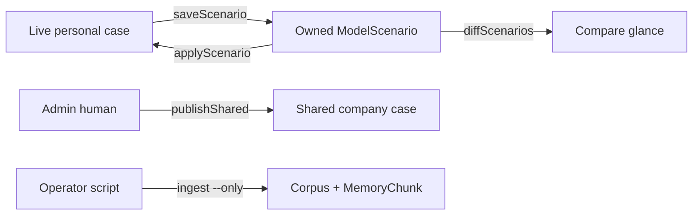

# Leftover what-ifs, compare, and R2 ingest

## Goal Capsule

Finish the leftover product work after live books and personal cases shipped: each person can **name a what-if**, **load it onto their live case**, and **compare two of their snapshots**. Then **run** the already-written R2 ingest plan — do not re-plan it.

**Authority:** `docs/contracts/CONTRACT-blue-variables-reports.md` and `docs/nico/12-blue-variables.md` for live cases; `docs/plans/2026-08-24-001-feat-r2-library-kb-ingest.md` for ingest; this plan for the leftover how.

**Stop if:** a change would make named what-ifs a second live case, leak grey keys to members, let an agent Publish the company case, save a sensitivity shock without an explicit save, write personal legal history into the KB, or run a full MemoryChunk wipe.

## Product Contract

### Summary

The live personal case stays the only working set. Named what-ifs are personal snapshots. Compare is two snapshots the caller owns. Admin Publish is a human-only company write. R2 ingest is executed as already planned.

### Problem Frame

Assumptions can Save / Reset / Publish one live case. Chat can glance meeting levers. There is no named what-if shelf in the chrome, no load-back, and no compare of two input sets. `model.saveScenario` / `model.diffScenarios` exist but list globally and expose the full variable JSON. R2 ingest is planned and partly coded; it has not been run.

### Requirements

- R1. A person can save the **current live case** as a named what-if without changing that live case.
- R2. A person can load one of **their** named what-ifs onto their personal case. Load never Publishes. Members cannot persist grey keys.
- R3. A person can compare two of **their** named what-ifs. Members see only blue inputs and statement totals they can already see.
- R4. Sensitivity shocks still do not persist unless the user names a save.
- R5. Admin Publish is a **human-only** procedure. Agents may still edit a personal case.
- R6. Deal Terms stay off Assumptions and off what-if snapshots as levers.
- R7. Execute `docs/plans/2026-08-24-001-feat-r2-library-kb-ingest.md` U2 then U3. Do not re-plan drawers. Do not start U4 until U2 is boring.
- R8. Personal legal history stays out of extracts, corpus, and embeddings.

### Actors

- Admin — personal what-ifs; human Publish of the company case; runs ingest.
- Member — personal what-ifs on blue keys only.
- Nico — save / load / compare / set personal variables. Never Publish. Never ingest via a Node script on Workers.

### Key Flows

- F1. “Save this as Rate shock” snapshots the live case under that name for this profile.
- F2. “Load Rate shock” copies that snapshot onto this profile’s personal case.
- F3. “Compare Rate shock and Base” diffs two owned snapshots; glance, not the book.
- F4. Admin clicks Publish → human-only company write.
- F5. Operator runs one-object ingest with `--only`, then the Natalia backfill.

### Acceptance Examples

- AE1. Save-as does not change `caseSource` or the personal-case artifact title.
- AE2. Member load of an admin-authored snapshot cannot write grey keys.
- AE3. Member cannot list or diff another profile’s what-ifs.
- AE4. A shock without “save this as …” creates no snapshot.
- AE5. Agent invoke of Publish is refused; UI Publish still works for an admin human.
- AE6. Ingest `--only` does not delete other MemoryChunk `sourcePath`s. Nico can cite Natalia’s benchmark extract after U3.

### Scope Boundaries

**In:** named personal what-ifs, load, compare, Publish split, execute existing R2 ingest U2/U3.

**Out:** Grok Voice, Rive, required CI checks, uncommented Workflow binds, shared what-if library, live-vs-shared compare without a prior save, Workflow ingest (existing U4), new what-if table, Deal Terms inside a case, full chunk wipe, data-room publish.

**Carrying forward (session-settled):** personal case vs shared company row — Save / Reset / Publish; percents as 40; chat glance not the book; members do not edit grey keys (chosen over exposing payroll); Deal Terms off Assumptions; shocks do not save unless asked; no legal history in the KB.

## Planning Contract

### Key Technical Decisions

- KTD1. Two nouns. Live case = personal / shared / seed. Named what-if = snapshot. (session-settled: user-directed — chosen over stretching the personal-case row into a catalog.)
- KTD2. Reuse `ModelScenario` for snapshots. Add `model.applyScenario`. Scope `listScenarios` / `diffScenarios` / apply to **this profile**. Filter grey keys for members. (session-settled: user-directed — personal-only shelf, chosen over a shared library or both.)
- KTD3. Compare is two saved snapshot IDs. Live-vs-shared without a save is later.
- KTD4. Split Publish out of `model.setVariables` into `model.publishShared` with `humanOnly: true`, admin only.
- KTD5. Hide unlabeled `"Base case (auto)"` rows from the picker (`model.explain` already auto-saves those).
- KTD6. Execute the 2026-08-24 R2 plan. Cursor/operator runs the Node script now. A Nico ingest procedure waits for that plan’s U4.
- KTD7. `artifacts.list` must not grow a junk drawer of `__tamarindo_*` memos or scenario dumps.

### Assumptions

- `ModelScenario` already stores `name` + `variables` JSON. Owner scoping may use `createdById` already on the row; if a column is missing, **ask before migrating**.
- Compare glance is input deltas plus FY1/FY10 cash when those cells exist — not a second report book. `saveReportWorkbook` stays one global live book; do not persist two compared books there.

### Sequencing

1. Snapshot primitives (scope list/diff + apply).
2. Surfaces (Assumptions + chat) and Publish split — both need U1’s owner filter.
3. R2 ingest U2/U3 can run in parallel with 1–2; it does not share the case store.

### High-Level Technical Design

## Implementation Units

### U1. Snapshot primitives

**Goal:** A profile can save, list, apply, and diff only their named what-ifs, with grey keys hidden from members.

**Requirements:** R1, R2, R3, R6

**Files:** `lib/model/cell-store.ts`, `lib/procedures/model.ts`, `lib/procedures/model-case.test.ts`, `lib/model/cell-graph.test.ts`

**Approach:** Keep `saveScenario` as insert of the current run. Add `applyScenario` that writes allowed keys through `saveModelValues` (never `publishSharedCase`). Scope list/diff/apply by `createdById ===` this profile. Strip admin-visibility keys from member list/diff/apply payloads. Exclude `name === "Base case (auto)"` from list.

**Dependencies:** none

**Test scenarios:**

- Save-as leaves the personal-case artifact unchanged.
- Member apply of a snapshot containing grey keys does not persist those keys.
- Member list/diff cannot see another profile’s rows.
- Apply refuses a missing or foreign id.
- Auto-saved `"Base case (auto)"` is absent from list.

**Verification:** `npx vitest run lib/procedures/model-case.test.ts lib/model/cell-graph.test.ts lib/model/store.test.ts`

### U2. What-if surfaces

**Goal:** Assumptions and Nico call the same save / list / apply / diff procedures.

**Requirements:** R1, R2, R3, R4

**Files:** `components/nico/variables-workspace.tsx`, `lib/nico/orchestrator.ts`, `lib/nico/assumption-intent.ts`, `lib/nico/assumption-intent.test.ts`, `lib/nico/orchestrator.test.ts`, `docs/nico/12-blue-variables.md`, `docs/contracts/CONTRACT-blue-variables-reports.md`

**Approach:** Assumptions: Save as / Load / Compare using the U1 procedures. Chat: “save this as {name}”, “load {name}”, “compare {A} and {B}”. Compare returns a glance table, not the book. Shock without a save phrase must not call `saveScenario`.

**Dependencies:** U1

**Test scenarios:**

- Orchestrator “save this as Rate shock” calls `model.saveScenario` and not `publishShared`.
- “load Rate shock” calls `model.applyScenario`.
- “compare A and B” calls `model.diffScenarios` and yields a compact table.
- “sensitivity on down” still does not save.
- “set down to 35%” still writes the personal case only.

**Verification:** `npx vitest run lib/nico/orchestrator.test.ts lib/nico/assumption-intent.test.ts`

### U3. Human-only Publish

**Goal:** Agents cannot write the company case.

**Requirements:** R5

**Files:** `lib/procedures/model.ts`, `components/nico/variables-workspace.tsx`, `lib/procedures/model-case.test.ts`, `lib/procedures/registry.test.ts`

**Approach:** New `model.publishShared` (`humanOnly`, admin). Remove `publishShared` from `model.setVariables`. UI Publish calls the new name.

**Dependencies:** none (merge carefully with U1 on `lib/procedures/model.ts`)

**Test scenarios:**

- Agent invoke of `model.publishShared` is forbidden.
- `model.setVariables` with `publishShared: true` is ignored or rejected.
- Member human cannot publish.
- Admin human publish still writes the shared title.

**Verification:** `npx vitest run lib/procedures/model-case.test.ts lib/procedures/registry.test.ts`

### U4. Execute R2 ingest U2/U3

**Goal:** Run the existing ingest plan; do not redesign shelves.

**Requirements:** R7, R8

**Files:** none new unless U2 of that plan requires a corpus-gate tweak in `lib/knowledge/vector-search.ts`. Authority: `docs/plans/2026-08-24-001-feat-r2-library-kb-ingest.md`

**Approach:** One object end-to-end with `--only`. Then Natalia benchmark backfill. Dry-run before `--apply`. Targeted embed of nulls only. No Workflow (that plan’s U4).

**Dependencies:** none

**Test scenarios:**

- `--only` upsert does not `deleteMany` other paths.
- Excluded-topic filename writes no chunk.
- After backfill, `knowledge.search` can cite Natalia’s competitor categories.

**Verification:** `npx vitest run lib/storage/r2-schema.test.ts lib/knowledge/` plus the existing plan’s dry-run / `--only` checklist.

## Verification Contract

- `npx vitest run lib/procedures/model-case.test.ts lib/model/store.test.ts lib/model/cell-graph.test.ts lib/nico/orchestrator.test.ts lib/nico/assumption-intent.test.ts lib/procedures/registry.test.ts lib/storage/r2-schema.test.ts lib/knowledge/`
- Do not click Publish against the live company case unless Ricardo asks.
- Do not run `ingest-memory-chunks.mjs --apply` without `--only`.

## Definition of Done

- A person can save / load / compare **their** named what-ifs from Assumptions and from chat via the same procedures.
- Members never see or persist grey keys through those paths.
- Agents cannot Publish.
- Sensitivity still does not save unless asked.
- Natalia’s benchmark is ingested with `--only` (or blocked with a named reason).
- Abandoned experiment code is gone from the diff.
