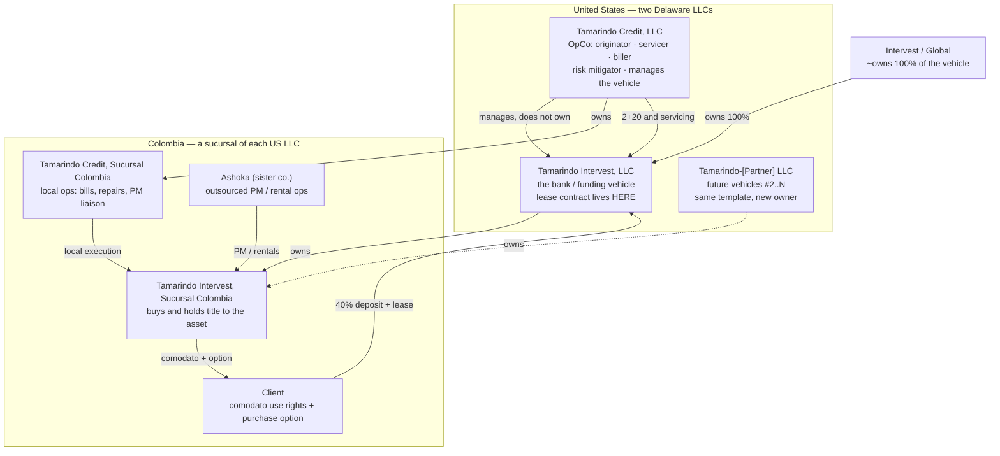

# 02 — Entity Architecture: The Tamarindo Family

*Roles, ownership of risk, and money flows across the sister entities.
Live structure is FACT from Dov on the Aug 20 Granola call
(`69c16e2e-bb63-43de-8c4c-eacffefbe284`) and restated Aug 26. Ashoka
(user input, Aug 21) and OPINION on labor split sit below that.*

**Hard line:** Tamarindo Credit does **not** own Tamarindo Intervest.
Intervest owns the vehicle. Tamarindo Credit **manages** it and earns
2 + 20. Both companies are US LLCs; each has its own Colombian sucursal.

## The map

## The entities

### Tamarindo Credit, LLC — the operating company (where the value accrues)

Delaware OpCo. Rosario is incorporating it (possibly repurposing an
existing KIT entity). This is what the OpCo fundraise is against. It owns
the brand, the app, underwriting policy, servicing/billing, title-study
process, Formulario 4 capital-intake admin, insurance coordination, and
the capital-partner **relationship**. Lean core (~3 US + 2 Colombia).
US-side OpCo pay (founder seats) routes through this P&L, not Colombian
payroll (FACT — Dov, 27 Aug).

**Earns:** origination, 2% activation on each Intervest drawdown,
servicing, ~20% of client billings, PM charge-through / markup, rental
share. **Owns no properties, ever.**

**Manages Tamarindo Intervest. Does not own it.**

### Tamarindo Intervest, LLC — funding vehicle #1 (Intervest-owned)

A **US (Delaware) company**. **100% owned by Intervest** (the Global
fund; notes say ~$25B). Tamarindo Credit is the servicer/originator.
Intervest is named in contract fine print, not in retail marketing, and
does not deal with end clients.

The **US lease is with Tamarindo-Intervest LLC**. The client's 40% and
ongoing payments **wire to that US company** (Ricardo, 27 Aug). Its
Colombian sucursal buys the asset and holds title. Default / recovery
risk sits on that title — cushioned by the 40% down and 60% max LTV.

Pilot: $20M ($10M Medellín + $10M Cartagena). No exclusivity; Intervest
holds ROFR. Partner #2 would be another US LLC on the same template.

### The two sucursales (not a third OpCo)

There is no separate "Tamarindo Colombia Inc." in the live structure.
Each US LLC has its **own** Colombian branch:

- **Tamarindo Intervest, Sucursal Colombia** — the entity that **buys
  and holds title**. Formulario 4 / supplementary investment from the
  US parent funds it. This is the recovery advantage: title already sits
  here.
- **Tamarindo Credit, Sucursal Colombia** — local execution: property
  management liaison, repairs, local bills, comodato admin, notary
  support. If this branch is profitable it faces Colombian CIT (CONTEXT:
  35% cited Aug 20; was 19% pre-Petro). The US lessee has no Colombian
  tax event on the lease.

**OPINION (thesis, Aug 19):** keep the Credit sucursal an execution arm,
not a profit center — speed and clean closings. Local margin lives in
Ashoka.

**MODEL OVERRIDE (Ricardo, 2026-08-23):** the shipped cash-flow book
still treats a for-profit Colombian book that bills clients for closing,
diligence, and monthly admin, plus a US mandate. It may run cash-flow
negative while thin. That is a model choice, not a third legal entity.

### Ashoka — the service layer (sister company)

Property management, maintenance, and rental operations for the
portfolio: furnishing coordination, listing and pricing on rental
channels, guest/tenant management, cleaning/repairs, and remittance of
rental income through the waterfall. This is where the Aug 19 rental-pool
decision (Tamarindo rents the property when the client isn't using it and
keeps ~20%) gets executed.

**Earns:** market-rate management fees (ASSUMPTION: ~18–22% of gross on
short-term rentals, ~8–10% on long-term), maintenance charge-through with
a markup, and potentially furnishing packages.

**Related-party discipline (important, OPINION):** Ashoka serves the
funding vehicles' assets, and vehicle LPs will scrutinize related-party
contracts. Pricing must be at documented market rates, disclosed in
vehicle docs, and terminable for non-performance. Done cleanly, Ashoka is
a strength (aligned operator, one throat to choke); done sloppily, it is
a diligence red flag.

## Money flow for one deal (illustrative)

$750k Cartagena apartment; client puts ~$300k down (40%); vehicle funds
~$450k through its sucursal.

1. **Closing:** client wires the 40% deposit to **Tamarindo Intervest,
   LLC**; that vehicle (via its sucursal) buys the asset. Tamarindo
   Credit earns 2% activation on the Intervest draw (~$9k) + origination
   (who pays it — vehicle, client, or mix — still open).
2. **Monthly:** client pays the US-law lease **on the Intervest vehicle**
   (≈$5.8k/mo at **11.84% effective** over 10y with a **20%-of-asset
   residual**, $150k on this $750k shape — see 04). Tamarindo Credit
   services and bills, retains servicing + ~20% of billings, remits the
   rest to the vehicle.
3. **When rented** (default **30% of the time** — clients want to use their
   homes; see 04): Ashoka rents the unit; gross rent splits into Ashoka's
   management fee (20%), operating costs (25%), ~20% Tamarindo share of the
   remainder, and the rest credited to the client — offsetting their lease
   payment.
4. **Maintenance:** Ashoka performs, charges through with markup.
5. **Exit:** client exercises the purchase option (residual balloon);
   title transfers from the sucursal; the vehicle recycles capital into
   the next property.
6. **Default path:** cure period → comodato termination → recovery by the
   sucursal (it already holds title — this is the structure's key
   enforcement advantage) → re-lease or sell; client's down payment is
   the vehicle's cushion.

## Open structural items (from the sources — not yet resolved)

- Legal characterization of the lease (usury / consumer-credit / true
  lease vs. disguised financing) — Colombian and US opinions pending.
- Tax treatment of sucursal ownership and cross-border payment flows.
- Origination fee level and who pays it (client vs. vehicle).
- Whether Ashoka stays a sister company or a vendor — OPINION: keep
  separate; it may serve non-Tamarindo properties, and separation keeps
  vehicle diligence clean. There is no third "Tamarindo Colombia"
  company in the live legal map.
