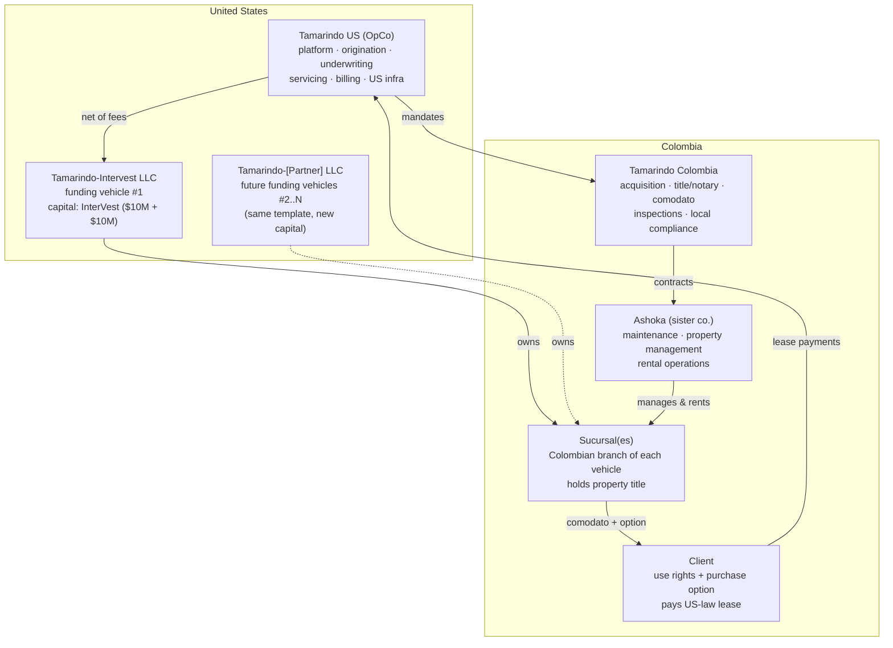

# 02 — Entity Architecture: The Tamarindo Family

*Roles, ownership of risk, and money flows across the sister entities.
Structure per the Aug 19 call and Aug 18 debrief, extended with Ashoka
(user input, Aug 21) and OPINION on how the pieces should divide labor.*

## The map

## The entities

### Tamarindo US — the operating company (where the value accrues)

The platform business and the entity investors buy into. It owns the
brand, the underwriting policy, the servicing/billing system, the contract
templates, and the capital-partner relationships. It employs the lean core
team (target: ~3 US + 2 Colombia, per Aug 19) and carries the tech budget.

**Earns:** origination fees, 2% activation fee on capital drawdown,
servicing fees, ~20% of interest billings (the spread share), and its
share of rental economics. **Owns no properties, ever.**

### Tamarindo-Intervest LLC — funding vehicle #1

The InterVest-backed vehicle: $10M committed with $10M more on success
(Aug 20), deployed roughly half Medellín / half Cartagena. It (through its
sucursal) owns the properties, receives the net lease stream, and earns
the base yield (capital priced at ~9–12%). Risk of client default and
asset recovery sits here — priced into the capital, cushioned by the ~40%
client down payment and 60% max LTV.

**OPINION — the template point:** this vehicle's docs, waterfall, and
reporting pack should be built as a *reusable template*. No exclusivity
was granted, so partner #2 gets "Tamarindo-[Partner] LLC" on identical
rails with only the economics page changing. The faster a new vehicle can
be stood up (target: weeks, not months), the more real the marketplace
thesis becomes.

### Tamarindo Colombia — the local execution arm

Handles everything that requires Colombian presence: property sourcing
and diligence support, notary/title closing for the sucursal, comodato
administration, inspections, tax/compliance filings, and recovery
execution if a deal goes bad. Small team (~2 people initially), scales
with unit count, paid by Tamarindo US via service agreement.

**OPINION (thesis, Aug 19):** keep it an execution arm, not a profit
center — its job is speed and legal cleanliness of closings. Local
margin lives in Ashoka.

**MODEL OVERRIDE (Ricardo, 2026-08-23):** the shipped cash-flow book
treats Tamarindo Colombia as a **for-profit sucursal**. It bills clients
for closing, diligence, and monthly administration, plus a US mandate. It
is allowed to run cash-flow negative while the book is thin. Do not force
a wash to zero. This overrides the execution-arm OPINION above until the
thesis is rewritten to match.

### Ashoka — the service layer (sister company)

Property management, maintenance, and rental operations for the
portfolio: furnishing coordination, listing and pricing on rental
channels, guest/tenant management, cleaning/repairs, and remittance of
rental income through the waterfall. This is where the Aug 19 rental-pool
decision (Tamarindo rents the property when the client isn't using it and
keeps ~20%) gets executed.

**Earns:** market-rate management fees (ASSUMPTION: ~18–22% of gross on
short-term rentals, ~8–10% on long-term), maintenance charge-through with
a markup, and potentially furnishing packages.

**Related-party discipline (important, OPINION):** Ashoka serves the
funding vehicles' assets, and vehicle LPs will scrutinize related-party
contracts. Pricing must be at documented market rates, disclosed in
vehicle docs, and terminable for non-performance. Done cleanly, Ashoka is
a strength (aligned operator, one throat to choke); done sloppily, it is
a diligence red flag.

## Money flow for one deal (illustrative)

$750k Cartagena apartment; client puts ~$300k down (40%); vehicle funds
~$450k through its sucursal.

1. **Closing:** client pays down payment; Tamarindo-Intervest draws $450k
   → Tamarindo US earns 2% activation (~$9k) + origination fee (level
   TBD — undecided in sources).
2. **Monthly:** client pays the US-law lease (~$4.5–5.5k/mo at 10–12%
   over 10y with a 10–20% residual — see 04). Tamarindo US services and
   bills, retains its servicing fee + ~20% of the interest component,
   remits the rest to the vehicle.
3. **When unoccupied:** Ashoka rents the unit; gross rent splits into
   Ashoka's management fee, operating costs, ~20% Tamarindo share, and
   the remainder credited to the client — offsetting their lease payment.
4. **Maintenance:** Ashoka performs, charges through with markup.
5. **Exit:** client exercises the purchase option (residual balloon);
   title transfers from the sucursal; the vehicle recycles capital into
   the next property.
6. **Default path:** cure period → comodato termination → recovery by the
   sucursal (it already holds title — this is the structure's key
   enforcement advantage) → re-lease or sell; client's down payment is
   the vehicle's cushion.

## Open structural items (from the sources — not yet resolved)

- Legal characterization of the lease (usury / consumer-credit / true
  lease vs. disguised financing) — Colombian and US opinions pending.
- Tax treatment of sucursal ownership and cross-border payment flows.
- Origination fee level and who pays it (client vs. vehicle).
- Whether Tamarindo Colombia and Ashoka are truly separate entities or
  divisions — OPINION: keep separate; Ashoka may serve non-Tamarindo
  properties one day, and separation keeps vehicle diligence clean.
